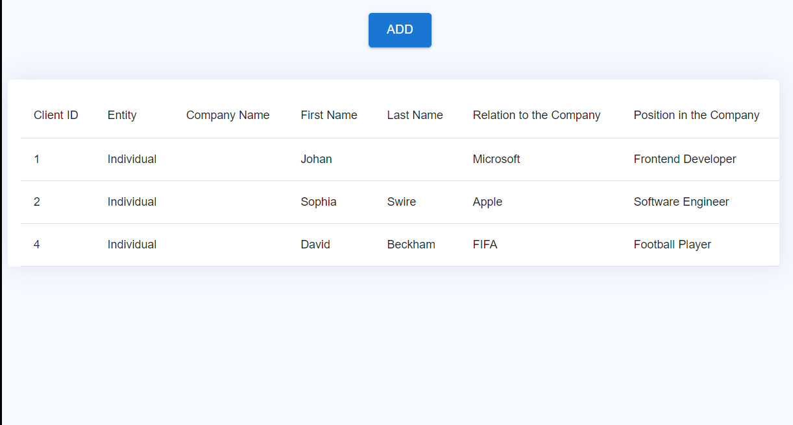

# Typescript GraphQL Form

Form with a CustomSelect component for adding data to list, strong typing and error handling.

Stack used: `Typescript, React, MaterialUI, GraphQL`

Implemented features: `form, list, add to list, API integration`

## Описание решения

Напишу на русском о том что я сделал и что не сделал по тестовому заданию. Я четко придерживался требуемых функций и реализовал все как просили.

- Проект я построил без использования `Create React App`, использовал webpack как было запрошено
- Переиспользуемый компонент CustomSelect находится в `src/components/UserForm`, если бы он использовался в двух местах то я бы вынес глобально, но сейчас он относится только к форме
- Добавление данных в список я реализовал через модальное окно используя компонент `Modal` из `mui`
- При ошибках в форме поле становятся красными, например если что-то не заполнить
- 

## Preview

 

## Development

Copy the repository and open the project folder in terminal.

1. Run `npm i`

2. Starting the server `npm run dev`

3. Server will run here => http://localhost:3000

